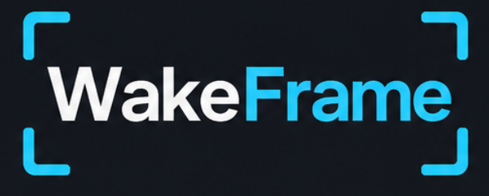

# WakeFrame

<p align="center">
	
</p>

WakeFrame is a lightweight Windows tray app that plays a fullscreen wake video when the user returns to their PC. It can trigger on resume, unlock, sign-in, or Windows startup, then hands playback to a short-lived player process so the background agent stays small while idle.


Steam Staturn video used in demo: designed by [tossEAC](https://steamdeckrepo.com/user/16942), from [Saturn](https://steamdeckrepo.com/post/ndWkb/saturn).

## Workspace

This is a Rust workspace split into focused crates:

- `wakeframe-agent`: tray process, startup registration, and Windows event handling
- `wakeframe-ui`: settings window for trigger options, video folder selection, and rotation management
- `wakeframe-player`: fullscreen libmpv video player launched only when playback is needed
- `wakeframe-common`: shared config and video discovery code

Settings are stored per user at `%APPDATA%\WakeFrame\config.json`.

## Run Locally

Build everything:

```bash
cargo build --workspace
```

Open the settings UI:

```bash
cargo run --bin wakeframe-ui
```

Start the tray agent:

```bash
cargo run --bin wakeframe-agent -- idle
```

Test playback directly with a local video:

```bash
cargo run --bin wakeframe-player -- "C:\Videos\wake.mp4"
```

Simulate a resume trigger without sleeping the PC:

```bash
cargo run --bin wakeframe-agent -- simulate-resume
```

## Development

Run the test suite and formatter before handing off changes:

```bash
cargo test --workspace
cargo fmt
```

## Releases

Pushing a version tag builds a Windows installer and attaches it to a GitHub Release:

```bash
git tag v0.1.0
git push origin v0.1.0
```

The release workflow produces `WakeFrame-Setup.exe` for users to download and run. Users do not need installer-building tools; Inno Setup is only used by maintainers or GitHub Actions to compile the setup file from `installer\WakeFrame.iss`.

Manual workflow runs also build the installer and publish it as a workflow artifact.

To inspect the bundled app locally without installer tooling, build a portable ZIP:

```powershell
.\scripts\package-portable.ps1 -Version "0.1.0"
```

The portable bundle is written to `dist\WakeFrame-Portable-0.1.0.zip`.

To compile the installer locally, install Inno Setup once:

```powershell
winget install JRSoftware.InnoSetup
```

Then build the installer with:

```powershell
.\scripts\package-installer.ps1 -Version "0.1.0"
```

The local installer compiler writes `dist\installer\WakeFrame-Setup.exe`.

WakeFrame is Windows-first and uses native Windows APIs for tray integration, startup registration, power/session notifications, and the fullscreen player window.
